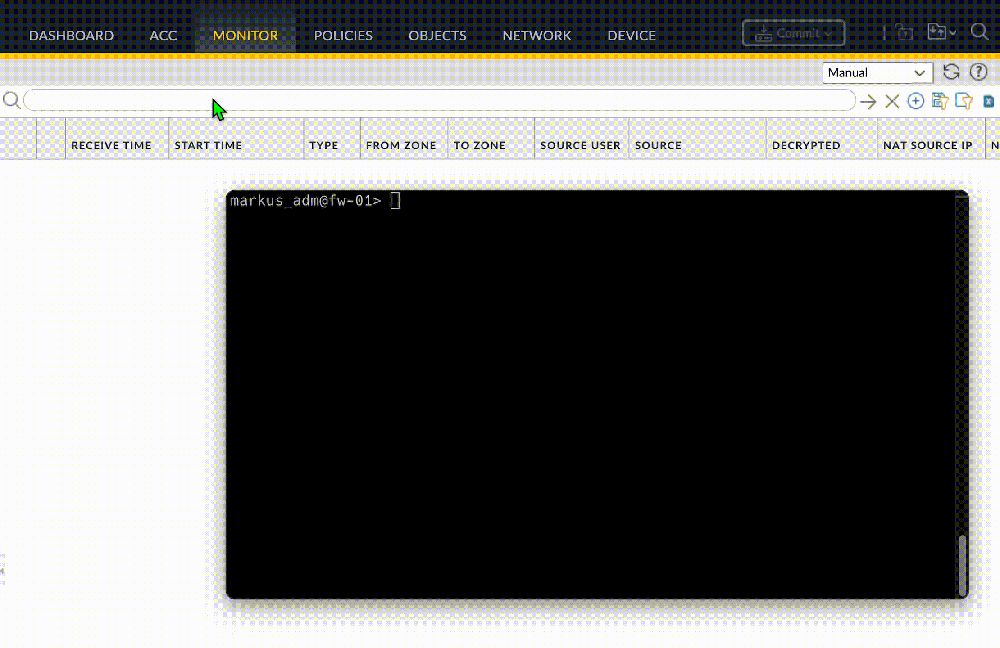
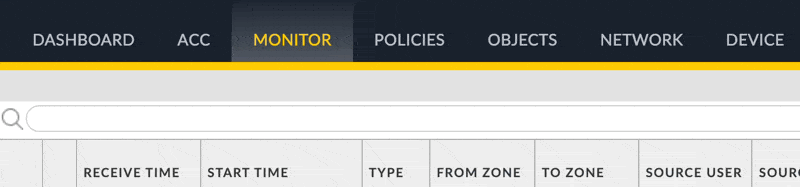
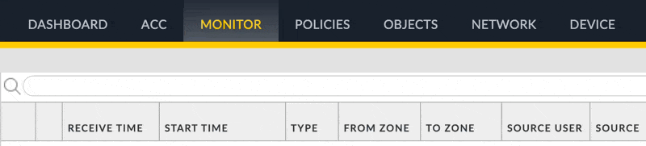
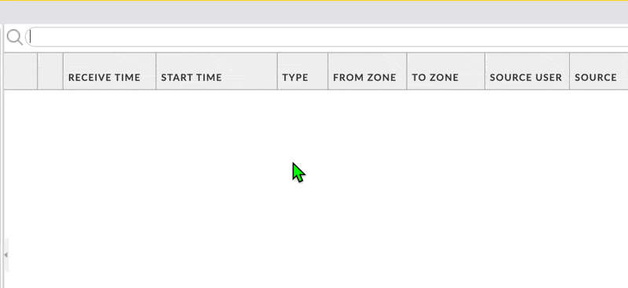

# Espanso PAN

An [espanso](https://espanso.org/) package for generating

- monitor filter syntax
- policy filter syntax
- CLI commands

for [Palo Alto Networks](https://en.wikipedia.org/wiki/Palo_Alto_Networks) Next Generation Firewalls and Panorama.

Espanso is a text expander.

The idea is to save time on daily troubleshooting and administrative tasks. Triggers should also work when used in a remote session, as it's just like typing the characters yourself.

## Demo



## How to install espanso and this package

Follow the espanso docs instructions for [Linux](https://espanso.org/docs/install/linux/), [macOS](https://espanso.org/docs/install/mac/) or [Windows](https://espanso.org/docs/install/win/).

If you use homebrew it's just:
```bash
brew install espanso
```

Start espanso (if it isn't running after already) 

### pan-snippets (this package)

```bash
espanso install pan-snippets
```

That's it. Test if it works by typing one of the triggers like `:pallow` 

## How to update

If a new version of this package is released you can update to the new version with

```bash
espanso package update pan-snippets
```

## Trigger Syntax 

All triggers start with `:p` followed by a keyword. For this README file the following convention is used:

- `:p` trigger identifier for this Espanso package
- `keyword` followed by keyword to trigger the specific action. Goal: Easy to remember
- `<dynamic>` (only required for a few triggers) dynamic regex part that is required for the completion to work.

The list of commands in this README is not exhaustive. You can see all in the `package.yml` of this package.

## Examples Monitor Filter Syntax

### less/greater then or equal custom time

Syntax: `:pleq<time>` and `:pgeq<time>`

Example: `:pleq1842` will be replaced by `( receive_time leq '2025/05/13 18:42:00' )`



### multiple choice insert current clipboard

Syntax: `:pclip`

Example: `:plcip` offers a choice, and then it uses your clipboard content to build the filter syntax. Might help, if you have to manually copy from a ticketing system or similar sources.


### source and destination actions

Syntax: `:psrcip` or `:pdstip` or `:psrczone` or ...

Example: `psrcip` will be replaced by `( addr.src in '' )` with the cursor position in quotes.



### filter for specific traffic

Syntax: `:pallow`, `:pdeny`, `:paction`, `:p0b`

Example: `:pallow` expands to ( action eq 'allow' )


## Examples: Filter Policies

Syntax: `:pdisabled`, `:pnolog`, `:pname`

Example: `:pnolog` expands to `(log-end eq 'no')` to show policies with no logging enabled


## Examples: CLI commands

### Set packet capture stage filenames based on current date

`:pcapfiles` expands to

```text
debug dataplane packet-diag set capture stage receive file 2025-05-14_00-24_rc
debug dataplane packet-diag set capture stage firewall file 2025-05-14_00-24_fw
debug dataplane packet-diag set capture stage transmit file 2025-05-14_00-24_tm
debug dataplane packet-diag set capture stage drop file 2025-05-14_00-24_dr
```

where the filename contains the current date and time.


### Set packet capture filter with CIDR source and/or destination range

`:pcapfilter` opens a form and expands to

```text
debug dataplane packet-diag set filter match source 10.13.37.42 source-netmask 24 destination 9.9.9.9 destination-netmask 32
```


### capture helpers

`:pcapon` expands to `debug dataplane packet-diag set capture on`

`:pcapoff` expands to `debug dataplane packet-diag set capture off`

`:pcapcounter` expands to `show counter global filter packet-filter yes delta yes`

### lookup route in FIB

`:proutelookup` expands to `test routing fib-lookup virtual-router default ip`

### export TSF file

`:ptsf` shows a form to enter scp/ssh details


and expands to the command that exports the tech support file via scp.

### MISC commands

`:ptopm` top for management-plane expands to `show system resources follow`

`:ptopd` top for data-plane expands to `show running resource-monitor`

`:pike` expands to `show vpn ike-sa gateway`

`:pipsec` expands to `show vpn ipsec-sa tunnel`

`:pfqdn` expands to `show dns-proxy fqdn all`

and more. Check the source of this package.

## Contributing: Syntax, trigger considerations

When I initially had the idea to use [Espanso](https://espanso.org/) for this, I thought of having separate triggers for monitor filters, policy filters and terminal commands. Something like

- p**M**srcip
- p**P**name
- p**T**info

I noticed quite fast that those triggers are harder to remember and decided to just prepend everything with `:p` and then use very easy to remember names, if possible I used keywords from the original syntax and I even preferred slightly longer ones, like `:pallow` over `:pall` (or so). I'm trying to include commands that might be used very frequently by the majority of admins and troubleshooters.

Although Espanso [shell extensions](https://espanso.org/docs/matches/extensions/#shell-extension) can be very powerful, I'm trying to avoid using them, so that everything works universally on Linux, Mac and Windows and with no dependencies.

I'm also trying to not include any destructive commands like clearing firewall logs,shutting down the firewall or resetting sc3. You can easily extend your own config with those, if you need them frequently.

Contributions welcome.
